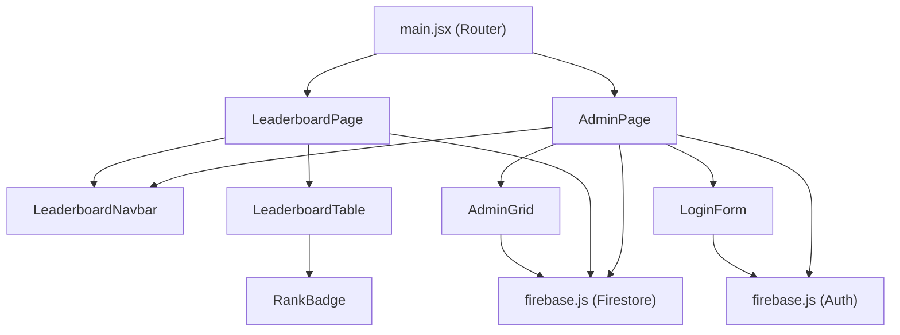

# 📋 Advitya'26 Leaderboard — Developer Documentation

> Complete reference for every component, function, and method in the Leaderboard module.

---

## Table of Contents

- [Architecture Overview](#architecture-overview)
- [Firebase Setup — `firebase.js`](#firebase-setup--firebasejs)
- [Routing — `main.jsx`](#routing--mainjsx)
- [Pages](#pages)
  - [`LeaderboardPage`](#leaderboardpage)
  - [`AdminPage`](#adminpage)
- [Components](#components)
  - [`LeaderboardNavbar`](#leaderboardnavbar)
  - [`LeaderboardTable`](#leaderboardtable)
  - [`RankBadge` & `getRankRowClass`](#rankbadge--getrankrowclass)
  - [`LoginForm`](#loginform)
  - [`AdminGrid`](#admingrid)
- [Firestore Data Model](#firestore-data-model)
- [Official Documentation Links](#official-documentation-links)

---

## Architecture Overview

```
src/
├── main.jsx                                    # App entry & router
├── pages/
│   ├── LeaderboardPage.jsx                     # Public live-scores page
│   └── AdminPage.jsx                           # Auth-gated admin panel
└── Advitya26Components/Leaderboard/
    ├── firebase.js                             # Firebase init (Auth + Firestore)
    ├── LeaderboardNavbar.jsx                   # Shared top-nav
    ├── LeaderboardTable.jsx                    # Animated ranked table
    ├── RankBadge.jsx                           # Medal badges + row styling
    ├── LoginForm.jsx                           # Email/password login form
    └── AdminGrid.jsx                           # Full CRUD score grid
```



---

## Firebase Setup — `firebase.js`

**Path:** `src/Advitya26Components/Leaderboard/firebase.js`

Initialises the Firebase SDK and exports shared instances for the entire module.

| Export | Type | Description |
|--------|------|-------------|
| `app` | `FirebaseApp` | The initialised Firebase application (internal, not exported) |
| `db` | `Firestore` | Cloud Firestore database instance |
| `auth` | `Auth` | Firebase Authentication instance |

### Functions Used

| Function | Source | Purpose | Docs |
|----------|--------|---------|------|
| [`initializeApp(config)`](https://firebase.google.com/docs/reference/js/app.md#initializeapp) | `firebase/app` | Creates and initialises a Firebase app from the provided config object | [initializeApp](https://firebase.google.com/docs/reference/js/app.md#initializeapp) |
| [`getFirestore(app)`](https://firebase.google.com/docs/reference/js/firestore_.md#getfirestore) | `firebase/firestore` | Returns the default Firestore instance for the app | [getFirestore](https://firebase.google.com/docs/reference/js/firestore_.md#getfirestore) |
| [`getAuth(app)`](https://firebase.google.com/docs/reference/js/auth.md#getauth) | `firebase/auth` | Returns the Auth instance for the app | [getAuth](https://firebase.google.com/docs/reference/js/auth.md#getauth) |

---

## Routing — `main.jsx`

**Path:** `src/main.jsx`

### `ScrollToTop()`

A utility component that scrolls the page to the top on every route change. Supports hash-based scrolling to anchor elements.

| Behaviour | Condition |
|-----------|-----------|
| Scrolls to element by ID | URL contains a `#hash` |
| Scrolls to page top | No hash present |

**React hooks used:** `useEffect`, `useLocation` ([React Router docs](https://reactrouter.com/en/main/hooks/use-location))

### Leaderboard Routes

| Path | Component | Description |
|------|-----------|-------------|
| `/advitya/leaderboard` | `<LeaderboardPage />` | Public live scoreboard |
| `/advitya/admin` | `<AdminPage />` | Admin panel (auth-gated) |

---

## Pages

### `LeaderboardPage`

**Path:** `src/pages/LeaderboardPage.jsx`
**Export:** `default`

Public-facing page that displays real-time team scores.

#### State

| State Variable | Type | Initial | Purpose |
|---------------|------|---------|---------|
| `teams` | `Array<Object>` | `[]` | List of all team documents from Firestore |
| `games` | `Array<Object>` | `[]` | List of game configs from Firestore |
| `loading` | `boolean` | `true` | Loading spinner toggle |
| `error` | `string` | `""` | Error message display |

#### `useEffect` — Real-time Firestore Listeners

Sets up **two** `onSnapshot` listeners on mount:

| Listener | Firestore Path | Purpose | Docs |
|----------|----------------|---------|------|
| `unsubConfig` | `doc(db, "config", "settings")` | Subscribes to the game configuration document | [onSnapshot (doc)](https://firebase.google.com/docs/firestore/query-data/listen#listen_to_a_document) |
| `unsubTeams` | `collection(db, "teams")` | Subscribes to the entire `teams` collection | [onSnapshot (collection)](https://firebase.google.com/docs/firestore/query-data/listen#listen_to_multiple_documents) |

Both listeners are **unsubscribed** in the cleanup function to prevent memory leaks.

#### Firebase Functions Used

| Function | Purpose | Docs |
|----------|---------|------|
| [`onSnapshot(ref, onNext, onError)`](https://firebase.google.com/docs/reference/js/firestore_.md#onsnapshot) | Attaches a real-time listener | [onSnapshot](https://firebase.google.com/docs/reference/js/firestore_.md#onsnapshot) |
| [`doc(db, path, ...segments)`](https://firebase.google.com/docs/reference/js/firestore_.md#doc) | Gets a `DocumentReference` | [doc](https://firebase.google.com/docs/reference/js/firestore_.md#doc) |
| [`collection(db, path)`](https://firebase.google.com/docs/reference/js/firestore_.md#collection) | Gets a `CollectionReference` | [collection](https://firebase.google.com/docs/reference/js/firestore_.md#collection) |

---

### `AdminPage`

**Path:** `src/pages/AdminPage.jsx`
**Export:** `default`

Auth-gated admin panel. Shows `LoginForm` when unauthenticated, or the `AdminGrid` when signed in.

#### State

| State Variable | Type | Initial | Purpose |
|---------------|------|---------|---------|
| `user` | `User \| null` | `null` | Current Firebase Auth user |
| `authLoading` | `boolean` | `true` | Whether auth state is still resolving |
| `teams` | `Array<Object>` | `[]` | Team documents from Firestore |
| `games` | `Array<Object>` | `[]` | Game config from Firestore |
| `error` | `string` | `""` | Error message |

#### Methods

##### `useEffect` — Auth State Observer

```js
onAuthStateChanged(auth, (currentUser) => { ... })
```

Listens for authentication state changes. Updates `user` and sets `authLoading = false`.

| Docs | [onAuthStateChanged](https://firebase.google.com/docs/reference/js/auth.md#onauthstatechanged) |
|------|------|

##### `useEffect` — Firestore Listeners (runs when `user` changes)

Only subscribes when `user` is authenticated. Same pattern as `LeaderboardPage` — dual `onSnapshot` for `config/settings` and `teams` collection.

##### `handleLogout()`

```js
async handleLogout() → void
```

Signs the user out using Firebase Auth and navigates to `/advitya/leaderboard`.

| Function | Docs |
|----------|------|
| [`signOut(auth)`](https://firebase.google.com/docs/reference/js/auth.md#signout) | [signOut](https://firebase.google.com/docs/reference/js/auth.md#signout) |

---

## Components

### `LeaderboardNavbar`

**Path:** `src/Advitya26Components/Leaderboard/LeaderboardNavbar.jsx`
**Export:** `default`

Fixed-position navigation bar shared between the Leaderboard and Admin pages.

| Feature | Details |
|---------|---------|
| Brand link | Navigates to `/advitya` |
| Leaderboard link | Navigates to `/advitya/leaderboard` |
| Admin link | Navigates to `/advitya/admin` |

**Dependencies:** `react-router-dom` → [`Link`](https://reactrouter.com/en/main/components/link)

---

### `LeaderboardTable`

**Path:** `src/Advitya26Components/Leaderboard/LeaderboardTable.jsx`
**Export:** `default`

Displays the ranked leaderboard with animated row transitions.

#### Props

| Prop | Type | Description |
|------|------|-------------|
| `teams` | `Array<{ id, name, scores }>` | All team documents |
| `games` | `Array<{ id, name }>` | All game configs |

#### `rankedTeams` — (computed via `useMemo`)

```js
useMemo(() => {
    // 1. Calculate total score per team across all games
    // 2. Sort descending by total
    // 3. Assign rank (1-based index)
}, [teams, games])
```

Returns an array of team objects augmented with `total` and `rank` properties, sorted by score descending.

| React Hook | Docs |
|------------|------|
| [`useMemo`](https://react.dev/reference/react/useMemo) | [useMemo](https://react.dev/reference/react/useMemo) |

#### Empty States

| Condition | Message |
|-----------|---------|
| `teams.length === 0` | "No teams yet — Scores will appear here once the event begins." |
| `games.length === 0` | "Please wait while we setup the games..." |

#### Animation

Uses [Framer Motion](https://motion.dev/docs/react-quick-start) for row enter/exit/layout animations:

| Motion Prop | Value | Purpose |
|-------------|-------|---------|
| `layout` | `true` | Animates position when rank order changes |
| `initial` | `{ opacity: 0, y: 10 }` | Fade-in + slide-up on enter |
| `animate` | `{ opacity: 1, y: 0 }` | Final visible state |
| `exit` | `{ opacity: 0 }` | Fade-out on removal |
| `transition` | `{ duration: 0.3, ease: "easeOut" }` | Timing config |

---

### `RankBadge` & `getRankRowClass`

**Path:** `src/Advitya26Components/Leaderboard/RankBadge.jsx`
**Exports:** `default` (RankBadge), named `getRankRowClass`

#### `RankBadge({ rank })`

Renders a medal badge for ranks 1–3, or a plain circle for other ranks.

| Rank | Emoji | Colour |
|------|-------|--------|
| 1 | 🥇 | Yellow/Gold |
| 2 | 🥈 | Silver/Gray |
| 3 | 🥉 | Bronze/Amber |
| 4+ | — | Gray circle |

#### `getRankRowClass(rank) → string`

Returns CSS classes to style the table row based on rank:

| Rank | Left Border Colour |
|------|--------------------|
| 1 | `border-l-yellow-500` + gold glow |
| 2 | `border-l-gray-400` + silver glow |
| 3 | `border-l-amber-600` + bronze glow |
| 4+ | `border-l-transparent` |

---

### `LoginForm`

**Path:** `src/Advitya26Components/Leaderboard/LoginForm.jsx`
**Export:** `default`

Email/password login form for admin authentication.

#### State

| State Variable | Type | Initial | Purpose |
|---------------|------|---------|---------|
| `email` | `string` | `""` | Email input value |
| `password` | `string` | `""` | Password input value |
| `error` | `string` | `""` | Error message to display |
| `loading` | `boolean` | `false` | Submit button loading state |

#### `handleSubmit(e)`

```js
async handleSubmit(e: FormEvent) → void
```

1. Prevents default form submission
2. Calls [`signInWithEmailAndPassword(auth, email, password)`](https://firebase.google.com/docs/reference/js/auth.md#signinwithemailandpassword)
3. Handles specific Firebase Auth error codes:

| Error Code | User-Facing Message | Docs |
|------------|---------------------|------|
| `auth/invalid-email` | "Invalid email address." | [Auth errors](https://firebase.google.com/docs/auth/admin/errors) |
| `auth/user-not-found` | "No account found with this email." | — |
| `auth/wrong-password` | "Incorrect password." | — |
| `auth/invalid-credential` | "Invalid credentials. Please try again." | — |
| _(default)_ | "Login failed. Please try again." | — |

| Firebase Function | Docs |
|-------------------|------|
| [`signInWithEmailAndPassword`](https://firebase.google.com/docs/reference/js/auth.md#signinwithemailandpassword) | [signInWithEmailAndPassword](https://firebase.google.com/docs/reference/js/auth.md#signinwithemailandpassword) |

---

### `AdminGrid`

**Path:** `src/Advitya26Components/Leaderboard/AdminGrid.jsx`
**Export:** `default`

Full CRUD interface for managing teams, games, and scores.

#### Props

| Prop | Type | Description |
|------|------|-------------|
| `teams` | `Array<{ id, name, scores }>` | All team documents |
| `games` | `Array<{ id, name }>` | All game configs |

#### State

| State Variable | Type | Initial | Purpose |
|---------------|------|---------|---------|
| `newTeamName` | `string` | `""` | Input value for creating a new team |
| `newGameName` | `string` | `""` | Input value for creating a new game |
| `editingTeam` | `string \| null` | `null` | ID of the team currently being renamed |
| `editingGame` | `string \| null` | `null` | ID of the game currently being renamed |
| `editValue` | `string` | `""` | Current value in the inline rename input |
| `error` | `string` | `""` | Error message banner |

---

#### Score Management

##### `handleScoreChange(teamId, gameId, value)`

```js
async handleScoreChange(teamId: string, gameId: string, value: string) → void
```

Updates a single score for a specific team/game combination. Rejects negative or non-numeric values.

| Firebase Function | Firestore Operation | Docs |
|-------------------|---------------------|------|
| [`updateDoc(docRef, data)`](https://firebase.google.com/docs/reference/js/firestore_.md#updatedoc) | Updates `scores.<gameId>` field on the team document | [updateDoc](https://firebase.google.com/docs/reference/js/firestore_.md#updatedoc) |

---

#### Team CRUD

##### `addTeam()`

```js
async addTeam() → void
```

Creates a new team document with the given name and initialises all game scores to `0`.

| Firebase Function | Operation | Docs |
|-------------------|-----------|------|
| [`addDoc(collectionRef, data)`](https://firebase.google.com/docs/reference/js/firestore_.md#adddoc) | Adds a new document to the `teams` collection with an auto-generated ID | [addDoc](https://firebase.google.com/docs/reference/js/firestore_.md#adddoc) |

##### `removeTeam(teamId, teamName)`

```js
async removeTeam(teamId: string, teamName: string) → void
```

Deletes a team document after user confirmation via `window.confirm`.

| Firebase Function | Operation | Docs |
|-------------------|-----------|------|
| [`deleteDoc(docRef)`](https://firebase.google.com/docs/reference/js/firestore_.md#deletedoc) | Deletes the team document from the `teams` collection | [deleteDoc](https://firebase.google.com/docs/reference/js/firestore_.md#deletedoc) |

##### `renameTeam(teamId)`

```js
async renameTeam(teamId: string) → void
```

Updates the `name` field of the specified team document.

| Firebase Function | Operation | Docs |
|-------------------|-----------|------|
| [`updateDoc(docRef, data)`](https://firebase.google.com/docs/reference/js/firestore_.md#updatedoc) | Updates the `name` field | [updateDoc](https://firebase.google.com/docs/reference/js/firestore_.md#updatedoc) |

---

#### Game CRUD

##### `addGame()`

```js
async addGame() → void
```

1. Generates a unique ID (`g<timestamp>`)
2. Appends the new game to the config document
3. Uses a **batch write** to initialise `scores.<newGameId> = 0` on every existing team

| Firebase Function | Operation | Docs |
|-------------------|-----------|------|
| [`setDoc(docRef, data, options)`](https://firebase.google.com/docs/reference/js/firestore_.md#setdoc) | Merges the updated `games` array into `config/settings` | [setDoc](https://firebase.google.com/docs/reference/js/firestore_.md#setdoc) |
| [`writeBatch(db)`](https://firebase.google.com/docs/reference/js/firestore_.md#writebatch) | Creates an atomic batch write | [writeBatch](https://firebase.google.com/docs/reference/js/firestore_.md#writebatch) |
| [`batch.update(docRef, data)`](https://firebase.google.com/docs/reference/js/firestore_.writebatch.md#writebatchupdate) | Adds update operations to the batch | [WriteBatch.update](https://firebase.google.com/docs/reference/js/firestore_.writebatch.md#writebatchupdate) |
| [`batch.commit()`](https://firebase.google.com/docs/reference/js/firestore_.writebatch.md#writebatchcommit) | Executes all batch operations atomically | [WriteBatch.commit](https://firebase.google.com/docs/reference/js/firestore_.writebatch.md#writebatchcommit) |

##### `removeGame(gameId, gameName)`

```js
async removeGame(gameId: string, gameName: string) → void
```

1. Removes the game from the config document
2. Uses a **batch write** to delete the score key from every team

| Firebase Function | Operation | Docs |
|-------------------|-----------|------|
| [`setDoc(docRef, data, { merge: true })`](https://firebase.google.com/docs/reference/js/firestore_.md#setdoc) | Merges the filtered `games` array | [setDoc](https://firebase.google.com/docs/reference/js/firestore_.md#setdoc) |
| [`writeBatch(db)`](https://firebase.google.com/docs/reference/js/firestore_.md#writebatch) | Batch operation to clean up scores | [writeBatch](https://firebase.google.com/docs/reference/js/firestore_.md#writebatch) |

##### `renameGame(gameId)`

```js
async renameGame(gameId: string) → void
```

Updates the game name in the config document's `games` array.

| Firebase Function | Operation | Docs |
|-------------------|-----------|------|
| [`setDoc(docRef, data, { merge: true })`](https://firebase.google.com/docs/reference/js/firestore_.md#setdoc) | Merges updated `games` array | [setDoc](https://firebase.google.com/docs/reference/js/firestore_.md#setdoc) |

---

#### Reset

##### `handleReset()`

```js
async handleReset() → void
```

Resets **all** team scores to `0` across all games using an atomic batch write. Requires `window.confirm` approval.

| Firebase Function | Operation | Docs |
|-------------------|-----------|------|
| [`writeBatch(db)`](https://firebase.google.com/docs/reference/js/firestore_.md#writebatch) | Atomic batch to zero all scores | [writeBatch](https://firebase.google.com/docs/reference/js/firestore_.md#writebatch) |

---

#### Computed Values

##### `sortedTeams`

```js
const sortedTeams = [...teams].sort((a, b) => a.name.localeCompare(b.name));
```

Returns a copy of teams sorted alphabetically by name for the admin grid (not by score — the leaderboard table sorts by score instead).

---

## Firestore Data Model

```
Firestore Root
├── config/
│   └── settings                 # Single document
│       └── games: [             # Array of game objects
│             { id: "g1708...", name: "Chess" },
│             { id: "g1709...", name: "Quiz" }
│           ]
│
└── teams/                       # Collection
    ├── {auto-id-1}
    │   ├── name: "Team Alpha"
    │   └── scores: {
    │         "g1708...": 15,
    │         "g1709...": 22
    │       }
    └── {auto-id-2}
        ├── name: "Team Beta"
        └── scores: { ... }
```

---

## Official Documentation Links

### Firebase

| Topic | Link |
|-------|------|
| Firebase JS SDK Setup | [Add Firebase to a web app](https://firebase.google.com/docs/web/setup) |
| Cloud Firestore | [Firestore Docs](https://firebase.google.com/docs/firestore) |
| Firestore — Add/Set Data | [Add data](https://firebase.google.com/docs/firestore/manage-data/add-data) |
| Firestore — Read Data | [Get data](https://firebase.google.com/docs/firestore/query-data/get-data) |
| Firestore — Real-time Listeners | [Listen to real-time updates](https://firebase.google.com/docs/firestore/query-data/listen) |
| Firestore — Batched Writes | [Transactions and batched writes](https://firebase.google.com/docs/firestore/manage-data/transactions) |
| Firestore — Delete Data | [Delete data](https://firebase.google.com/docs/firestore/manage-data/delete-data) |
| Firebase Authentication | [Auth Docs](https://firebase.google.com/docs/auth) |
| Auth — Email/Password Sign-in | [Email/Password auth](https://firebase.google.com/docs/auth/web/password-auth) |
| Auth — Manage Users | [Manage users](https://firebase.google.com/docs/auth/web/manage-users) |
| Firebase JS SDK Reference | [API Reference](https://firebase.google.com/docs/reference/js) |

### React & Libraries

| Library | Link |
|---------|------|
| React | [react.dev](https://react.dev/) |
| React Router v6 | [React Router Docs](https://reactrouter.com/en/main) |
| Framer Motion | [Motion Docs](https://motion.dev/docs/react-quick-start) |
| Lucide Icons (React) | [Lucide React](https://lucide.dev/guide/packages/lucide-react) |

---

> _Generated on 2026-02-20 for the Advitya'26 Leaderboard module — GDG on Campus VIT Bhopal._
